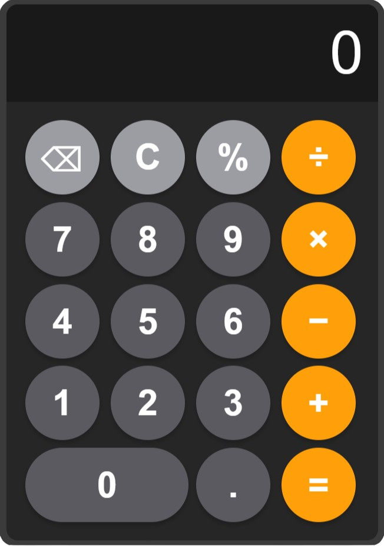

# 🔢 Simple Calculator - HTML, CSS & JavaScript

A lightweight and responsive calculator built with HTML, CSS, and JavaScript. This project was designed to practice front-end development and improve JavaScript logic handling.

## 📸 Calculator Preview



## ⚙️ Features

-  ✅ Modern and minimalist UI
-  ✅ Fully responsive design
-  ✅ Smooth button animations
-  ✅ Real-time calculations

## 👨🏻‍💻 Technologies Used

-  HTML5 & CSS3
-  JavaScript

## 🛠️ How It Works

Simply click the buttons to enter numbers and operations. The display dynamically updates in real-time.

## 🏁 Getting Started

Follow these steps to set up and run the calculator on your local machine.

### 📋 Prerequisites

Make sure you have:

-  A modern web browser (Chrome, Firefox, Edge, Safari)
-  A text editor (VS Code, Sublime Text, etc.)

## 🚀 Installation & Usage

1️⃣ **Download or Clone the Project**

-  **Manual Download**:
   1. Click on the **Code** button at the top of the GitHub page.
   2. Select **Download ZIP** and extract the folder on your PC.
-  **Using Git (optional)**:

   ```bash
   git clone https://github.com/YannWoj/Calculator.git
   ```

   2️⃣ **Open the Project**

-  Open the folder in **VS Code** or any text editor.

   3️⃣ **Run the Calculator**

-  **Method 1**: Double-click on `index.html` to open it in your web browser.
-  **Method 2 (Live Server)**:
   1. Install the **Live Server** extension in VS Code.
   2. Right-click `index.html` > **"Open with Live Server"**.

## ✨ Perfect for Beginners!

This project is ideal for anyone looking to improve their front-end development skills. It’s a great way to practice the basics of HTML, CSS, and JavaScript while building something interactive and useful.
